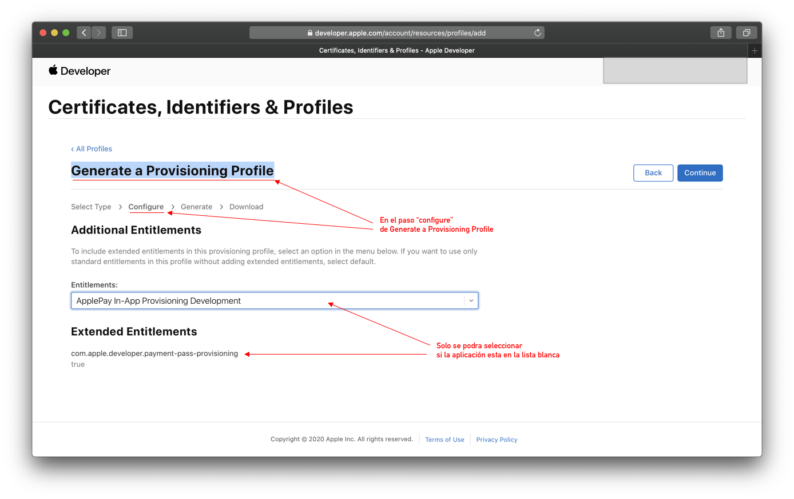

# Derechos de la aplicación


## Petición de derechos

Para que la aplicación pueda disponer de la funcionalidad de digitalizar tarjetas (Aprovisionamiento Push para Apple Pay) requiere un derecho especial de Apple llamado `com.apple.developer.payment-pass-provisioning`, se debe disponer de este derecho por parte de Apple. Ellos integraran el identificador de su aplicación en su lista blanca, y debe solicitar mediante un email a apple-pay-provisioning@apple.com. Se solicitaran tres datos para la inserción en la **lista blanca**:

- **Nombre de la aplicación** el nombre que aparecera en la terminal una vez instalada.
- El ID del equipo de desarrolo (**Developer team ID**), que se puede encontrar en https://developer.apple.com/account/#/membership
- **ADAM ID** para el que se pedira un ***Id de Pack*** o lo que es lo mismo el ***Bundle ID*** suministrado en *Xcode* (por ejemplo `es.sucompañia.SuAplicación`, una vez creado se le asignara un ***ID de Apple*** para la *App Strore* (supongamos `12345678`) y la unión de estos dos datos será el ***ADAM ID***, que segun los anteriores ejemplos será: `12345678.es.sucompañia.SuAplicación`.


## Aplicación de derecho

Para que la apicación compile habiendo aplicado estos derechos, se deberá usar un Provisioning Profile que los incluya. Si se ha elegido el identificador de la aplicación una vez se esté en la lista blanca de Apple al crear o editarla (en caso de ya existir), los **Provisioning Profile** (tanto el de desarrollo como el de producción), en el paso de la configuración se podrá elegir el derecho extendido ***ApplePay In-App Provisioning Development***.




## Implementación de derechos

Una vez la aplicación este incluida en la lista blanca de Apple, los siguientes permisos en el archivo **.entitlements** de la aplicación debe quedar literalmente así:

```xml
<?xml version="1.0" encoding="UTF-8"?>
<!DOCTYPE plist PUBLIC "-//Apple//DTD PLIST 1.0//EN" "http://www.apple.com/DTDs/PropertyList-1.0.dtd">
<plist version="1.0">
<dict>
	<key>com.apple.developer.payment-pass-provisioning</key>
	<true/>
	<key>com.apple.developer.pass-type-identifiers</key>
	<array>
		<string>$(TeamIdentifierPrefix)*</string>
	</array>
</dict>
</plist>

```
