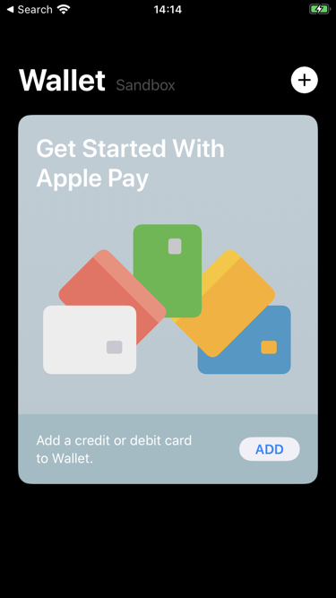
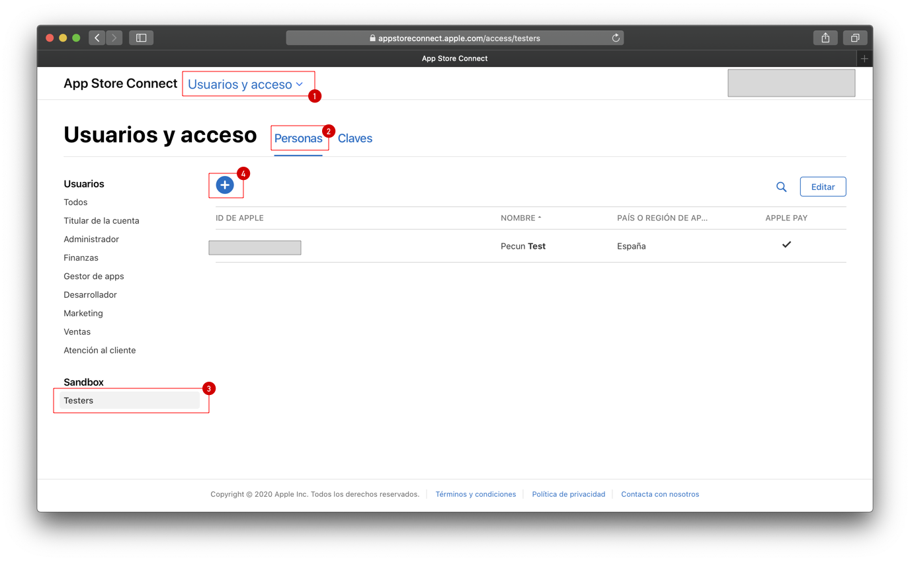
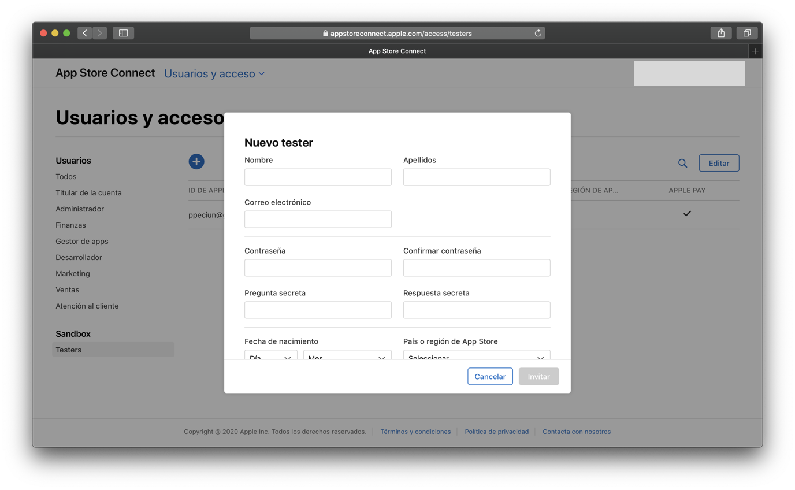

# Usuario de prueba de la caja de arena

La biblioteca solo funciona en dispositivos (no en simuladores), y la única manera de probar que funciona y las configuraciones están correctamente (antes de subir a la Tienda de aplicaciones) hechas en configurando un telefono con el usuario de iCloud del teléfono de tipo *Usuario de prueba de la caja de arena* (Sandboxed Test User). Y la manera de comprobar que esta bien configurado es abriendo la aplicación Wallet y comprobar que sale la palabra ***Sandbox*** a la derecha de la palabra wallet.

## Crear un usuario de prueba de la caja de arena 

Para crear un usuario de prueba de la caja de arena, se debe hacer desde el portar Appstore Connect, en el siguiente gráfico, se muestra el camino para llegar a esa configuración.

De esa manera se crearan las credenciales de ese usuario. Tal vez recordar que el correo electronico no debe coincidir con el de un usuario existente ya en iCloud.

Una vez creado el usuario se podra ingresar con el en el dispositivo iPhone de prueba. Y comprobar como en la primera captura de pantalla está bien configurado.

## Tarjetas de prueba

Para las pruebas de sandbox Pecunpay le proporcionará un PAN, una fecha de expiración y un cvv concretos para que las realice, ya que para Apple no vale cualquiera.
