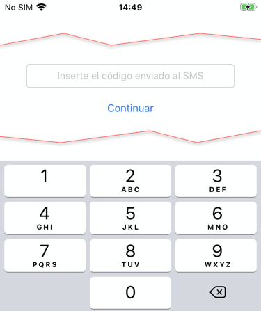

# Utilización de la biblioteca


La biblioteca **PecunPayInAppProvisioning** gestiona los pasos necesarios para la digitalización de tarjetas gestionadas por Pecunia Cards.


## Configurar la biblioteca

Importar la biblioteca

```swift
import PecunPayInAppProvisioning
```

Datos de la tarjeta a digitalizar:

```swift
let card = Card(scheme: .visa,
                paymentMethod: "A4208DC",
                primaryAccountIdentifier: "CRISTINA MERINO ASSETVERSE")
```

Sebe mantener una referencia fuerte a la librería (strong) durante todo el proceso:

```swift
private var inAppProvisioning: InAppProvisioning!
```

Antes de comenzar el proceso de digitalización de tarjeta, se debe inicializar la biblioteca (con sus datos de cliente) y asignarla a la referencia fuerte:

```swift
inAppProvisioning = InAppProvisioning(clientId: "usuario", clientSecret: "password")
```


## Proceso de digitalización de tarjeta


### Paso 1: Comprobar que la tarjeta no esté ya digitalizada

```swift
inAppProvisioning.checkIfCardIsProvisioned(card: card) {
    [weak self] (error: CheckCardError?, isCardProvisioned: Bool?) in
    
    guard let self = self else { return }
    
    if let error = error {
        
        switch error {
        case .cardIsNotSetted:
            break
        case .userIsNotVerified:
            break
        case .pecunpayServerError:
            break
        case .lostReferenceTolibrary:
            break
        case .issuerError:
            break
        }
        
    } else if let isCardProvisioned = isCardProvisioned {
        
        if !isCardProvisioned {
            // Solo en el caso de que la tarjeta no este digitalizada
            // se deberá mostrar el botón proporcionado por Apple
            self.showAddPassButton()
        }
        
    } else {
       // No hay respuesta
    }
    
}
```

Solo en el caso de que la tarjeta no este digitalizada se deberá mostrar el botón proporcionado por Apple


### Paso 2: Mostrar botón proporcionado por Apple 

Para poder mostrar el botón proporcionado por Apple se debe importar la biblioteca `PassKit`:

```swift
import PassKit
```

Presentación del botón proporcionado por Apple en pantalla

```swift
private func showAddPassButton() {
    addPassButton = PKAddPassButton(addPassButtonStyle: PKAddPassButtonStyle.black)
    addPassButton.translatesAutoresizingMaskIntoConstraints = false
    provisioningButtonView.addSubview(addPassButton)
    addPassButton.centerXAnchor.constraint(equalTo: provisioningButtonView.centerXAnchor).isActive = true
    addPassButton.centerYAnchor.constraint(equalTo: provisioningButtonView.centerYAnchor).isActive = true
    addPassButton.addTarget(self, action: #selector(tapInAddPayment), for: .touchUpInside)
}
```


### Paso 3: Manejar de la pulsación del botón

Al pulsar el botón proporcionado por Apple se debera: 

1. Llamar al método `sendSMS(for: Card)` , este hará que PecunPay envie un mensaje SMS al telefono móvil del propietario de la tarjeta.
2. Se debe habilitar un campo de texto para recopilar el código enviado por SMS.

```swift
// Manejador de la pulsación del botón
@objc private func tapInAddPayment(_ sender: Any) {
    
    if addPassButton != nil {
        addPassButton.removeFromSuperview()
        addPassButton = nil
    }
    
    inAppProvisioning.sendSMS(for: card) { [weak self] smsIsSended in
        // la aplicación cliente de nuestro SDK debe pedir al usuario el codigo que se ha enviado por SMS

        if smsIsSended {
            self?.smsCodeView.isHidden = false
            self?.smsCodeTextfield.becomeFirstResponder()
        } else {
            print("⚠️⚠️⚠️  OCURRIO UN ERROR  ⚠️⚠️⚠️")
        }
    }
    
}

```

Ejemplo de campo para recopilar código enviado por SMS




### Paso 4: Mostrar el controlador de vista para *In App Provisioning* de *Apple*

Para ello se llamará al método `showInAppProvisioningController(for:,withSmsCode:,in:)` de la biblioteca, donde se tendra qué especificar:

1. La estructura `Card` utilizada en los procesos anteriores:
2. La cadena de texto del código enviado por SMS recopilado anteriormente
3. El controlador de vista donde presentar el controlador de vista para *In App Provisioning* de *Apple*

```swift
inAppProvisioning.showInAppProvisioningController(for: card, withSmsCode: smsCode, in: self) {
    (error: ProvisionError?) in
    
    if let error = error {
        print(error)
    } else {
        print("🌈 SHOWING Apple In App Provisionin View Controller")
    }
}
```
